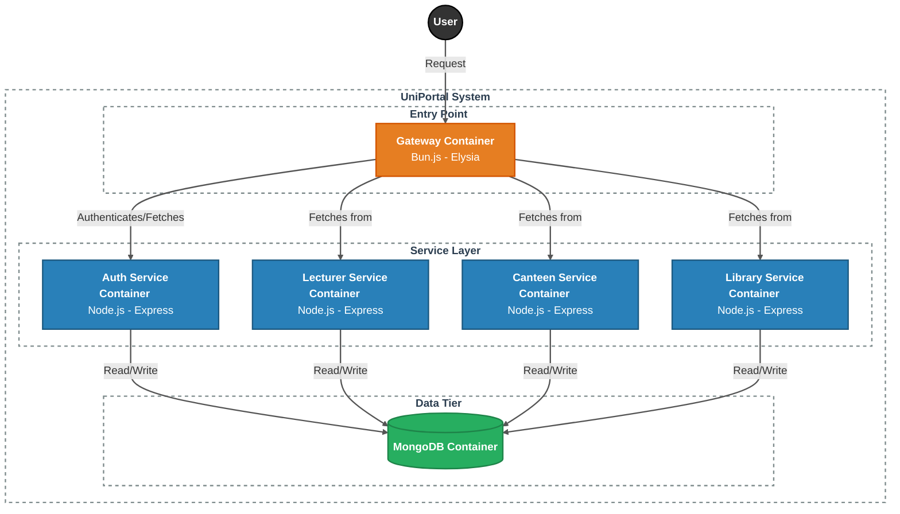

## System Architecture



---

## API Endpoints

### Base URL
> localhost:5000/api

---

### Lecturer Service APIs
> /api/lecturers

**Get All Lecturers**
> GET /api/lecturers

**Get Lecturer By ID**
> GET /api/lecturers/:id

**Create Lecturer**
> POST /api/lecturers

```json
{
  "name": "Dr. Kayanan",
  "department": "Physical Science",
  "email": "kayanan@vau.edu"
}
```

**Update Lecturer**
> PUT /api/lecturers/:id

**Delete Lecturer**
> DELETE /api/lecturers/:id

**Mark Attendance**
> POST /api/lecturers/:id/attendance

```json
{
  "status": "present"
}
```

**Get Attendance Logs**
> GET /api/lecturers/:id/attendance

---

### Canteen Service APIs
> /api/canteens

**Get All Canteens**
> GET /api/canteens

**Get Single Canteen**
> GET /api/canteens/:id

**Create Canteen**
> POST /api/canteens

**Update Menu**
> PATCH /api/canteens/:id/menu

```json
{
  "menu": ["rice", "thosai"]
}
```

**Report Queue Status**
> POST /api/canteens/:id/queue

```json
{
  "level": "high"
}
```

**Get Queue History**
> GET /api/canteens/:id/queue/logs

---

### Library Service APIs
> /api/libraries

**Get All Libraries**
> GET /api/libraries

**Get Single Library**
> GET /api/libraries/:id

**Create Library**
> POST /api/libraries

**Update Occupancy**
> POST /api/libraries/:id/occupancy

```json
{
  "count": 320
}
```

**Get Occupancy Logs**
> GET /api/libraries/:id/occupancy/logs

---

### Gateway APIs

**Dashboard API**
> GET /api/dashboard

```json
{
  "lecturersPresent": 12,
  "canteens": [
    { "name": "Ammachchi", "queue": "high" }
  ],
  "libraries": [
    { "name": "Main", "status": "full" }
  ]
}
```

---